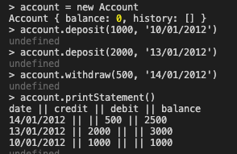

# bank-test

## Specification

### Requirements

* You should be able to interact with your code via a REPL like IRB or the JavaScript console.  (You don't need to implement a command line interface that takes input from STDIN.)
* Deposits, withdrawal.
* Account statement (date, amount, balance) printing.
* Data can be kept in memory (it doesn't need to be stored to a database or anything).

### Acceptance criteria

**Given** a client makes a deposit of 1000 on 10-01-2012  
**And** a deposit of 2000 on 13-01-2012  
**And** a withdrawal of 500 on 14-01-2012  
**When** she prints her bank statement  
**Then** she would see

```date || credit || debit || balance
14/01/2012 || || 500.00 || 2500.00
13/01/2012 || 2000.00 || || 3000.00
10/01/2012 || 1000.00 || || 1000.00
```

## Self-assessment

Once you have completed the challenge and feel happy with your solution, here's a form to help you reflect on the quality of your code: https://docs.google.com/forms/d/1Q-NnqVObbGLDHxlvbUfeAC7yBCf3eCjTmz6GOqC9Aeo/edit

# Process

In this section, I will document how I approached the problem.

## Planning

### User Stories

1. As a Client, So that I can safely store my earnings, I would like to be able to Deposit money into my bank account

    ```var account = new Account();

    account.deposit(1000); 
    account.currentBalance = 1000 
    ```

2. As a Client, So that I can buy a puppy, I would like to be able to Withdraw money from my bank account.

    ```var account = new Account();

    account.deposit(1000); 
    account.withdraw(500); 
    account.currentBalance = 500 
    ```


3. As a Client, So that I can keep track of my finances, I would like to be able to print a bank statement with dated deposits and withdrawals. 

```var account = new Account();

    account.deposit(1000);
    account.deposit(2000);

    account.withdraw(500); 

    account.printStatement();

      date || credit  || debit  || balance
14/01/2012 ||         || 500.00 || 2500.00
13/01/2012 || 2000.00 ||        || 3000.00
10/01/2012 || 1000.00 ||        || 1000.00 
```

## Running the project

### Setup 

1. First fork and clone the github repository to your local machine. 

#### Run from Browser

1. open 'index.html' 

#### Run from CommandLine

1. install Node

2. run ``` node ``` from the terminal

3. ``` .load ``` the file into your REPL with ``` .load [file-path]/bank_test.js ```

### Interact with the program

1. Interact and run the project from the javascript console of your browser using the following commands:

    Initialise new account with:
    ``` new_account = new Account ```

    Deposit into the account with:
    ``` new_account.deposit(amount, date); ```

    Withdraw from the account with:
    ``` new_account.withdraw(amount,date); ```

    Print bank statement with:
    ``` new_account.printStatement(); ```

### Tests

To run the tests, open 'SpecRunner.html' from here you will see the passing tests.

Additionally, navigate to ./client/spec/bank_test_Spec.js to see the Spec file itself.

## Program Running

